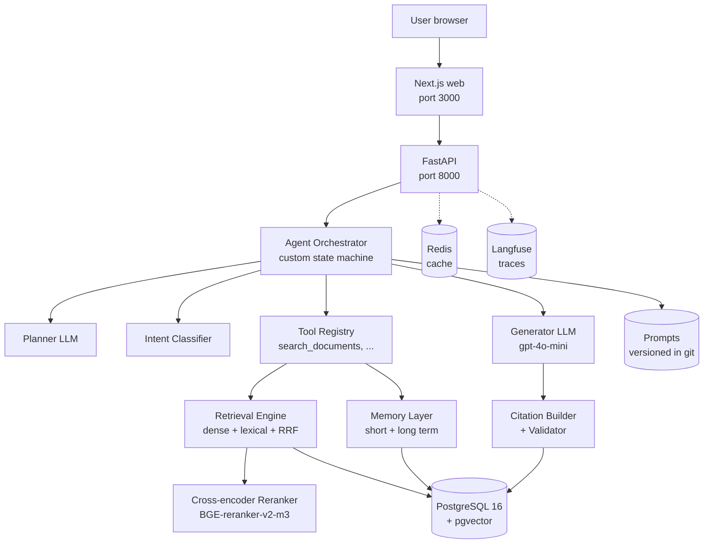

# System Design

> High-level architecture of the Agentic RAG Platform.

## High-level diagram

## Component responsibilities

| Component         | Responsibility                                                            |
| ----------------- | ------------------------------------------------------------------------- |
| Frontend (web)    | Chat UI, citation inspection, memory controls, admin dashboard            |
| API (FastAPI)     | HTTP layer, auth, request validation, response shaping                    |
| Agent Orchestrator| State machine: classify → plan → retrieve → validate → generate → verify  |
| Classifier        | Route query: simple / comparative / temporal / multi-hop / unsupported    |
| Planner           | Decompose query into sub-questions + tool assignments                     |
| Tool Registry     | Tool schemas, permission checks, argument validation, execution           |
| Retrieval Engine  | Dense (pgvector) + Lexical (FTS) + Hybrid (RRF) + Freshness boost         |
| Reranker          | Cross-encoder re-scoring of top 50 candidates → top 5                     |
| Memory            | Short-term (conversation) + Long-term (persistent, per-user)              |
| Citation Builder  | Parse [N] markers, map to chunks, validate via LLM-judge                  |
| Generator         | Produce grounded answer with inline citations                             |
| DB                | All persistent data: documents, chunks, embeddings, conversations, etc.  |
| Redis             | Embedding cache, query cache                                              |
| Langfuse          | OpenTelemetry traces, span tree, cost tracking                            |

## Request lifecycle

A typical `/query` request:

1. **Auth** — JWT validated; user loaded with role + permissions.
2. **Trace creation** — `trace_id` (UUID) generated; OpenTelemetry span opened.
3. **Agent run** — `run_agent()`:
   a. Classify query
   b. Plan (if not unsupported)
   c. For each plan step: tool call → retrieval → rerank → freshness boost
   d. Evidence sufficiency check
   e. Generate answer with [N] markers
   f. Validate citations (LLM-judge)
4. **Response shaping** — build `QueryResponse` with answer, citations, trace_id, confidence.
5. **Persistence** — save to `messages` table; extract long-term memories in background.
6. **Span close** — set attributes (latency, cost, citation count); export to Langfuse.

## Data stores

| Store         | Data                                                                     |
| ------------- | ------------------------------------------------------------------------ |
| PostgreSQL    | users, roles, permissions, documents, document_versions, document_chunks (with embedding + tsv), sources, conversations, messages, memories, citations, experiments, evaluations, retrieval_events, audit_logs |
| Redis         | embedding cache (key: sha256(text) + model), query cache (key: sha256(query + role + filters)) |
| S3            | original document files, database backups                                |
| Langfuse DB   | OpenTelemetry traces                                                     |

## Key design decisions

1. **Single Postgres** for relational + vector + FTS — simplifies operations and RBAC. See ADR-001.
2. **Custom agent state machine** — no LangGraph dependency. See ADR-004.
3. **RBAC in SQL WHERE clause** — pre-retrieval filtering, no post-filter leakage. See ADR-008.
4. **Separate memory table** — never mix with document_chunks; always filter by user_id. See ADR-005.
5. **Citation validation via LLM-judge** — don't trust the LLM's citations. See ADR-006.
6. **OpenTelemetry as wire protocol** — swap backends without code changes. See ADR-007.
